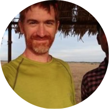

\  

## Instructors

\  

#### Alex Douglas
<div style= "float:left;position: relative; top: 5px;">
```{r, out.width = "200px", out.extra='style="padding:30px;"', echo = FALSE}
knitr::include_graphics("images/alex.png")
```
</div>

\ 

Alex is a Reader in Biostatistics at the University of Aberdeen and has been teaching (and learning) R for the last 17 years. 

- Email: a(dot)douglas(at)abdn(dot)ac(dot)uk
- Web: https://www.abdn.ac.uk/people/a.douglas/
- Twitter: https://twitter.com/Scedacity
- GitHub: https://github.com/alexd106

\  

\  

#### Thomas Cornulier
<div style= "float:left;position: relative; top: 5px;">
```{r, out.width = "200px", out.extra='style="padding:30px;"', echo = FALSE}

```
</div>

\  

Thomas is a Biostatistician at the University of Aberdeen and has been using R since version 1.2.1. 

- Email: cornulier(at)abdn(dot)ac(dot)uk
- Web: https://www.abdn.ac.uk/people/cornulier/
- Random (mostly R) resources: https://tcornulier.github.io
- Twitter: https://twitter.com/TCornulier
- GitHub: https://github.com/TCornulier

\  

\  